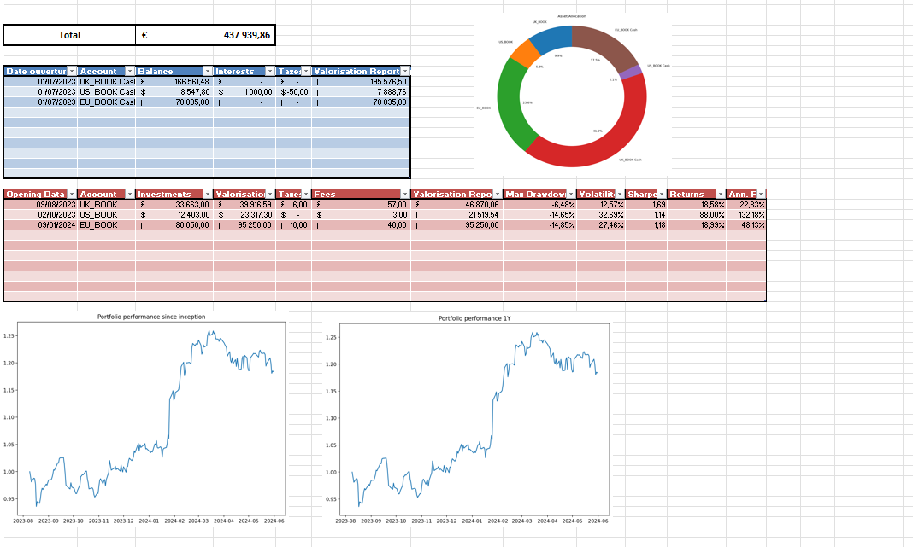
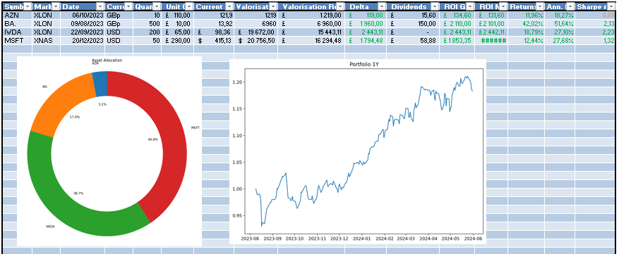

# Portfolio Tracker
A python-augmented excel spreadsheet to track portfolio performance.  Supports multiple books with multiple currencies. 

The framework is easily extendable to add extra plots or reports, contributions welcome!

## Visuals





## Getting started

Install the poetry environment:

```
> conda env create -f environment.yaml -n portfolio-tracker
```

```
> poetry install
```

You may have to install `xlwings` add on for excel to run the code.
The `main.xlsm` is connected to accordingly named `main.py`. 
You can update the example sheet by running the main run button within excel xlwings' tab or run the script from the terminal:

```
> conda activate portfolio-tracker
> python main.py
```
